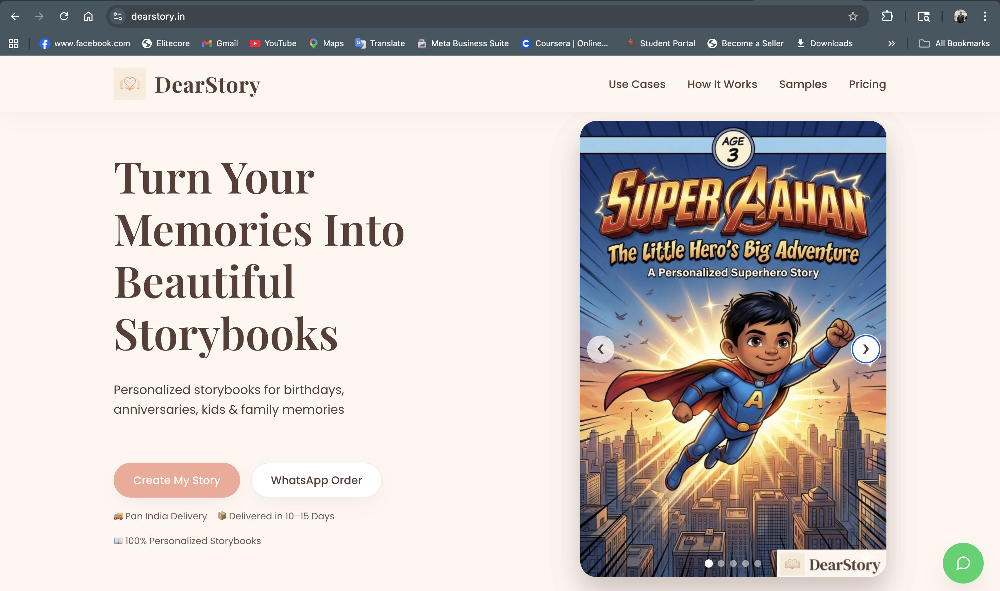
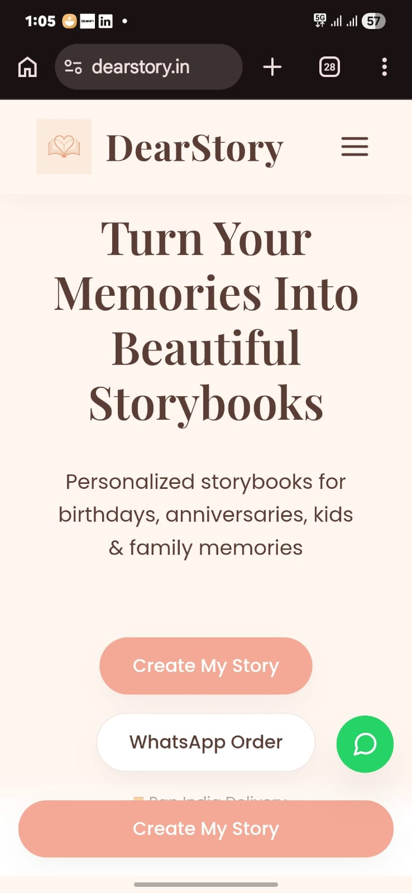

# DearStory

Your Story, Beautifully Told.

Live Website: https://dearstory.in

# DearStory — Personalized Storybook Platform
Your Story, Beautifully Told.

DearStory is a personalized storytelling platform that transforms real-life memories into beautifully designed storybooks.
We help individuals turn their emotions, relationships, and special moments into meaningful keepsakes.

## Demo

🌐 Live Website: https://www.dearstory.in  
📂 Repository: https://github.com/webgurdians/dearstory-website

## The Idea

In today's digital world, memories often remain stored in phones and social media. DearStory aims to bring those memories to life through personalized storybooks designed for:

Couples
Kids
Parents
Teachers
Pets
Special occasions

Users simply share their photos & story, and DearStory turns it into a beautifully crafted storybook.

Your Story, Beautifully Told.

## Problem

Memories remain digital and often get lost over time
Gift options lack personalization and emotional value
People want meaningful gifts but don't know how to create them

## Solution

DearStory creates personalized storybooks by combining:

Storytelling
Design
AI-assisted content generation
Custom illustrations
Print-ready formats

Users share their story, and DearStory converts it into a professionally designed storybook.

## Features
Personalized storytelling
Custom storybook design
Multiple story categories (Couples, Kids, Family, Pets, etc.)
Print-ready storybook formats
AI-assisted story creation
Emotional gifting concept

## Tech Stack
HTML
CSS
JavaScript
AI-assisted development using ChatGPT & Gemini
Deployment: Vercel
Version Control: GitHub

## Live Website

https://www.dearstory.in/

## Screenshots

### Homepage

### Sample Storybook

### Mobile View

## Sample Use Cases

Anniversary Storybooks
Kids Storybooks
Pet Storybooks
Parent Appreciation Storybooks
Teacher Appreciation Storybooks
Friendship Storybooks

## Future Roadmap

User Story Submission Portal
AI Story Generator
Custom Illustration Engine
Online Ordering System
Payment Integration
Print & Delivery Automation

## Why DearStory

DearStory focuses on emotional storytelling and meaningful gifting rather than generic products.
The goal is to create lasting memories through storytelling and design.

## Builder Note

This project is built as a solo builder initiative using AI-assisted development, rapid prototyping, and iterative design.
The focus is on validating the idea and building a scalable storytelling platform.

## Built By

Neel  
Solo Builder — DearStory

This project is built using AI-assisted development, rapid prototyping, and iterative product building.
